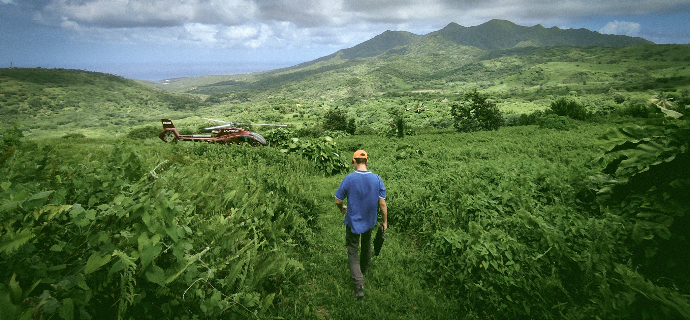

## Postdoctoral Research Fellow
### _Geophysics, Geology, Volcanology, Seismology_

---

**📍 Department of Earth and Environmental Sciences**  
🎓 **University of Exeter, UK**  

📞 **+44 7541 303 75** | 📧 [**ra500@exeter.ac.uk**](mailto:ra500@exeter.ac.uk)  
🔗 [**LinkedIn**](https://www.linkedin.com/in/rashemb)  
🔗 [**Twitter**](https://twitter.com/alshembari)

---

## 🎓 **Education**

---

🔍 **Ph.D. in Geology**
- **University of Exeter**
- 📍 Falmouth, UK | 2019-Present
- **Research:** [Exploring the influence of trans-crustal magmatic systems on volcano deformation](#)
- **Supervised by:** Dr. James Hickey, Prof. Ben Williamson & Prof. Katharine Cashman

🌍 **Postgraduate Diploma in Earth System Physics (Solid Earth)**
- **International Centre for Theoretical Physics (ICTP)**
- 📍 Trieste, Italy | 2017-2018
- **Research:** [Assessing the effects of frozen surface soil layer on the earthquake site response](#)
- **Supervised by:** Prof. Stefano Parolai & Dr. Denis Sandron

💡 **B.Sc. in Physics**
- **Islamic University of Gaza (IUG)**
- 📍 Gaza, Palestine | 2013-2017
- **Research:** [The impact of fluid substitution on the seismic AVO response](#)
- **Supervised by:** Dr. Mosab Nasser & Prof. Mohammed Shabat

---

## 🌟 **Professional Experience**

---

🔬 **Postdoctoral Research Fellow**
- **University of Exeter**
- 📍 Exeter, UK | [Start Date]-Present
- [Detailed responsibilities or significant projects](#)

📚 **Maths & Stats Support for CSM Students**
- **University of Exeter - FX Plus**
- 📍 Falmouth, UK | 2019-Present
- [Conducted math and stats support tutorials for undergraduate students.](#)

👩‍🏫 **Teaching Assistant**
- **University of Exeter**
- 📍 Falmouth, UK | 2019-Present
- [Subjects: Practical Geophysics, Practical Volcanology, Mathematics, Electronic Lab](#)

🌍 **Research Grant in Earthquake Seismology**
- **ICTP & OGS**
- 📍 Trieste, Italy | 2018-2019

---

## 🌏 **Outreach & Engagements**

---

- 🎤 [Physics Without Frontiers](#) | Guest Speaker | Trieste, 2018
- 🎤 [ESFRI Forum](#) | Guest Speaker | Paris, 2022
- 🌠 [Society of Astronomical Amateurs in Gaza](#) | Volunteer for public outreach

---

## 📣 **Invited Talks**

---

- 🌋 [Hotstuff Seminar](http://www.bristol.ac.uk/earthsciences/events/2023/hotstuff-seminar---alshembari-.html) | University of Bristol, UK | Feb 2023 
- 🌍 [Montserrat Volcano Observatory (MVO)](#) | Montserrat | Sept 2022
- 🌌 [ESFRI 20th Anniversary Conference](https://www.esfri.eu/rami-alshembari) | Paris | Mar 2022 
- 🌎 [ICTP Earth System Physics Department](#) | Trieste | May 2022

---

## 📰 **Media Highlights**

---

- 📝 [Historical Earthquake Impact Affected by Seasonal Factors | Seismological Society of America, 2019](https://www.seismosoc.org/news/historical-earthquake-impact-affected-by-seasonal-factors/)
- 📝 [Severity of Earthquake Impact & Seasons | University of Exeter News, 2019](https://www.exeter.ac.uk/global/news/middleeast/articles/severityofearthquakeimpac.html)

---

## 📚 **Publications**

---

### **Journal Articles:**

- [**2023**: Poroelastic Surface Deformation | _Soufrière Hills volcano, Montserrat_ | In Preparation](#)
- [**2023**: Rheological Control of Magmatic Systems on Deformation | _Under Review_](#)
- [**2022**: Poroelastic Mechanical Behavior of Crystal Mush Reservoirs](https://doi.org/10.1029/2022JB024332)
- [**2022**: Role of Fluid-Solid Interactions in Volcano Deformation](https://doi.org/10.1016/j.jvolgeores.2022.107535)
- [**2019**: Seasonality in Site Response](https://doi.org/10.1785/0220190114)

### **Conference Abstracts:**

- [**2022**: Thermo-poro-viscoelastic Approach for Volcanic Deformation | AGU Fall Meeting](https://www.agu.org/Fall-Meeting/Pages/default.aspx)

---

